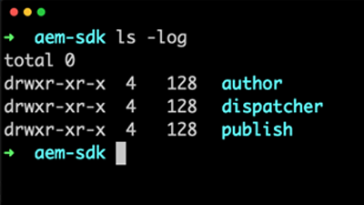
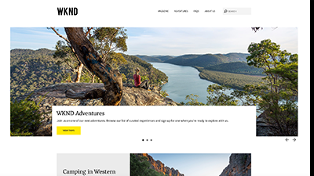

# Overview {#overview}

Adobe Experience Manager as a Cloud Service is the next generation of the AEM product line.

## What's New

* **[Local Development Environment Set Up (Tutorial)](./local-development-environment/overview.md)**
     
    *Learn how to set up your local machine for AEM as a Cloud Service development*

## Staff Picks

<table>
<td>
   
   

      <a href="./local-development-environment/overview.md">
      <strong>Local Development Environment Set up Tutorial</strong>
      </a>
   

   

      <em>Get your local machine ready for AEM as a Cloud Service development!</em>
   

</td>
<td>
   
   

      <a href="https://docs.adobe.com/content/help/en/experience-manager-learn/getting-started-wknd-tutorial-develop/overview.html">
      <strong>Get started developing for AEM Sites</strong>
      </a>
   

   

      <em>An end-to-end tutorial on how to develop a Web site in AEM.</em>
   

</td>
</table>

## Additional Resources

* [Experience League - Explore AEM](https://experienceleague.adobe.com/#recommended/solutions/experience-manager)
